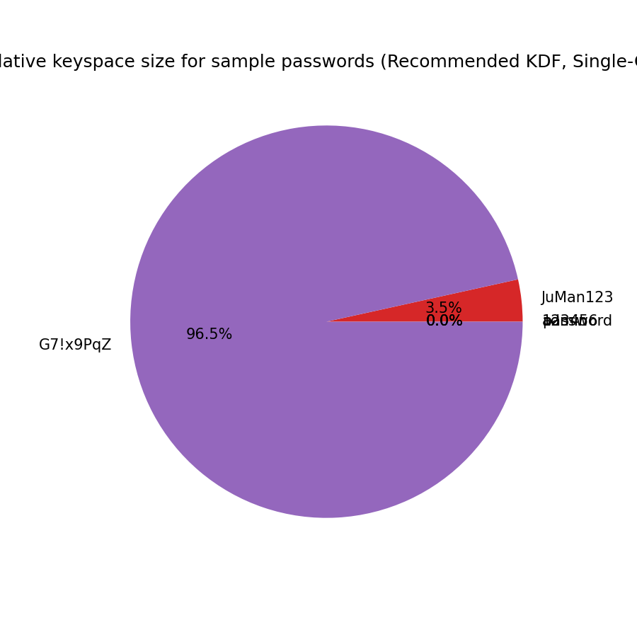

# Password Analysis Report (JuMan)
Hasil estimasi waktu brute-force untuk contoh password menggunakan model sederhana. Nilai adalah perkiraan. Lihat PNG untuk diagram.

## KDF scenario: Java-default (65536) (iterations=65536)
### Attacker: Laptop-CPU (raw ops/sec ~ 10000000)
|password|length|classes|keyspace|attempts/sec|avg time|worst time|
|---|---:|---:|---:|---:|---:|---:|
|admin|5|26|11881376|152.59|10h 48m|21h 37m|
|123456|6|10|1000000|152.59|54m|1h 49m|
|password|8|26|208827064576|152.59|21y 254d 23h 2m|43y 144d 22h 4m|
|JuMan123|8|62|218340105584896|152.59|22686y 360d 16h 6m|45373y 356d 8h 12m|
|G7!x9PqZ|8|94|6095689385410816|152.59|633382y 234d 2h 21m|1266765y 103d 4h 43m|

### Attacker: Single-GPU (raw ops/sec ~ 1000000000)
|password|length|classes|keyspace|attempts/sec|avg time|worst time|
|---|---:|---:|---:|---:|---:|---:|
|admin|5|26|11881376|15258.79|6m|12m|
|123456|6|10|1000000|15258.79|32s|1m|
|password|8|26|208827064576|15258.79|79d 4h 47m|158d 9h 34m|
|JuMan123|8|62|218340105584896|15258.79|226y 317d 12h 9m|453y 270d 19m|
|G7!x9PqZ|8|94|6095689385410816|15258.79|6333y 301d 15h 23m|12667y 238d 6h 46m|

### Attacker: GPU-Cluster (8x) (raw ops/sec ~ 8000000000)
|password|length|classes|keyspace|attempts/sec|avg time|worst time|
|---|---:|---:|---:|---:|---:|---:|
|admin|5|26|11881376|122070.31|48s|1m|
|123456|6|10|1000000|122070.31|4s|8s|
|password|8|26|208827064576|122070.31|9d 21h 35m|19d 19h 11m|
|JuMan123|8|62|218340105584896|122070.31|28y 130d 22h 31m|56y 261d 21h 2m|
|G7!x9PqZ|8|94|6095689385410816|122070.31|791y 265d 19h 55m|1583y 166d 15h 50m|

### Attacker: ASIC/Cloud (raw ops/sec ~ 100000000000)
|password|length|classes|keyspace|attempts/sec|avg time|worst time|
|---|---:|---:|---:|---:|---:|---:|
|admin|5|26|11881376|1525878.91|3s|7s|
|123456|6|10|1000000|1525878.91|327.68 ms|655.36 ms|
|password|8|26|208827064576|1525878.91|19h|1d 14h|
|JuMan123|8|62|218340105584896|1525878.91|2y 98d 1h 48m|4y 196d 3h 36m|
|G7!x9PqZ|8|94|6095689385410816|1525878.91|63y 123d 11h 11m|126y 246d 22h 23m|

## KDF scenario: Recommended (200000) (iterations=200000)
### Attacker: Laptop-CPU (raw ops/sec ~ 10000000)
|password|length|classes|keyspace|attempts/sec|avg time|worst time|
|---|---:|---:|---:|---:|---:|---:|
|admin|5|26|11881376|50.00|1d 9h|2d 18h|
|123456|6|10|1000000|50.00|2h 46m|5h 33m|
|password|8|26|208827064576|50.00|66y 79d 19h 10m|132y 159d 14h 21m|
|JuMan123|8|62|218340105584896|50.00|69235y 70d 13h 17m|138470y 141d 2h 34m|
|G7!x9PqZ|8|94|6095689385410816|50.00|1932930y 154d 19h 1m|3865860y 309d 14h 3m|

### Attacker: Single-GPU (raw ops/sec ~ 1000000000)
|password|length|classes|keyspace|attempts/sec|avg time|worst time|
|---|---:|---:|---:|---:|---:|---:|
|admin|5|26|11881376|5000.00|19m|39m|
|123456|6|10|1000000|5000.00|1m|3m|
|password|8|26|208827064576|5000.00|241d 16h 45m|1y 118d 9h 30m|
|JuMan123|8|62|218340105584896|5000.00|692y 128d 10h 55m|1384y 256d 21h 51m|
|G7!x9PqZ|8|94|6095689385410816|5000.00|19329y 111d 1h 9m|38658y 222d 2h 18m|

### Attacker: GPU-Cluster (8x) (raw ops/sec ~ 8000000000)
|password|length|classes|keyspace|attempts/sec|avg time|worst time|
|---|---:|---:|---:|---:|---:|---:|
|admin|5|26|11881376|40000.00|2m|4m|
|123456|6|10|1000000|40000.00|12s|25s|
|password|8|26|208827064576|40000.00|30d 5h 5m|60d 10h 11m|
|JuMan123|8|62|218340105584896|40000.00|86y 198d 13h 21m|173y 32d 2h 43m|
|G7!x9PqZ|8|94|6095689385410816|40000.00|2416y 59d 12h 8m|4832y 119d 17m|

### Attacker: ASIC/Cloud (raw ops/sec ~ 100000000000)
|password|length|classes|keyspace|attempts/sec|avg time|worst time|
|---|---:|---:|---:|---:|---:|---:|
|admin|5|26|11881376|500000.00|11s|23s|
|123456|6|10|1000000|500000.00|1s|2s|
|password|8|26|208827064576|500000.00|2d 10h|4d 20h|
|JuMan123|8|62|218340105584896|500000.00|6y 337d 2h 1m|13y 309d 4h 3m|
|G7!x9PqZ|8|94|6095689385410816|500000.00|193y 106d 23h 3m|386y 213d 22h 6m|

## Charts
.png)
.png)
